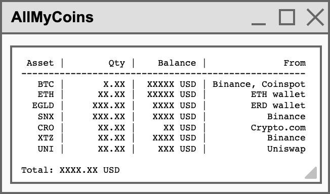

# AllMyCoins

AllMyCoins is a simple crypto portfolio manager.

- Ask your own API keys for exchangers (Read only is enough)
- Provide your public addresses
- Otherwise manually provide a list of tokens with quantities

## Features

- Automatically fetch your exchanger balances 
- Automatically fetch your balances and stacking rewards from blockchain addresses
- Support multiple currencies (USD, EUR, BTC, AUD...)

### Exchangers

-  Binance spot - https://www.binance.com
-  OKEx Unified - https://www.okex.com
-  https://crypto.com/exchange
- Coinspot - https://coinspot.com.au
- Swyftx - https://swyftx.com.au

### Blockchain public addresses

-  Bitcoin
-  Ethereum
-  Ethereum2.0 validator
-  Binance Smart Chain
-  Polkadot
-  Cardano
-  Litecoin
-  Tezos
-  MultiversX
-  Solana
-  Algorand
-  Harmony

##### Cosmos ecosystem
-  Cosmos
-  Osmosis
-  Akash
-  IRISnet
-  Juno
-  Comdex
-  Chihuahua
-  Stargaze
-  Regen
-  E-Money
-  Lum
-  Desmos

##### MultiversX ecosystem
*  MultiversX
From the public address, retrieves:
* EGLD: wallet balance, staking delegation, WEGLD, SEGLD, HSEGLD (not deposited in collateral)
* EDSTs:
    - WBTC
    - WETH
    - USDC
    - BUSD
    - USDT
    - MEX, XMEX
    - UTK (+ staked on XExchange)
    - HTM (+ staked on XExchange)
    - ASH
    - RIDE (+ staked on XExchange)
    - ITHEUM (+ staked on XExchange)
    - CRT (+ staked on XExchange)
    - BHAT (+ staked on XExchange)
    - ZPAY (+ staked on XExchange)

## Display

## Use it

Download the latest [Release](https://github.com/thomasWos/AllMyCoins/releases).

## Prerequisites

- Java 11 or higher

