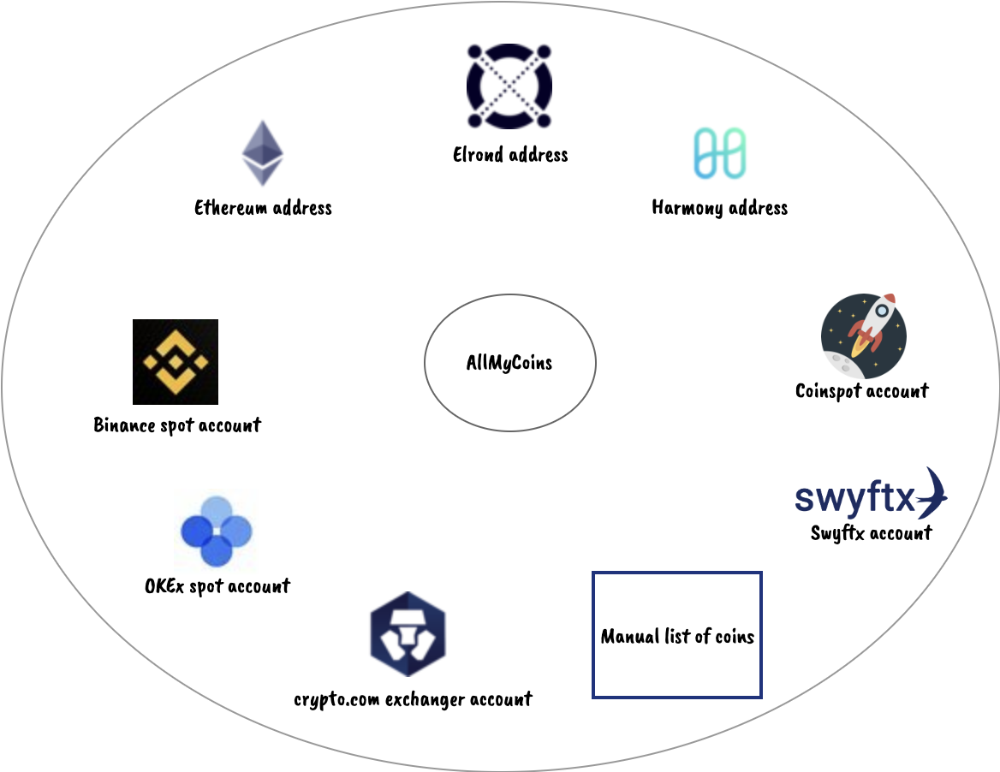

# AllMyCoins

All my coins is a simple crypto portfolio manager.

- Ask your own API keys for exchangers (Read only is enough)
- Provide your public addresses
- Otherwise manually fill a list of tokens and the quantity

## Features

- Automatically fetch your balances from exchangers
- Automatically fetch your balances and stacking rewards from blockchain addresses
- Support multiple currencies (USD, EUR, BTC, AUD...)

### Exchangers

- Binance spot
- OKEx spot
- crypto.com/exchange
- Coinspot (Australian exchanger)
- SWYFTX (Australian exchanger)

### Blochain public addresses

- Ethereum
- Elrond address
- Harmony address

## Display

## Prerequisites

- Java - JDK 11 or higher
